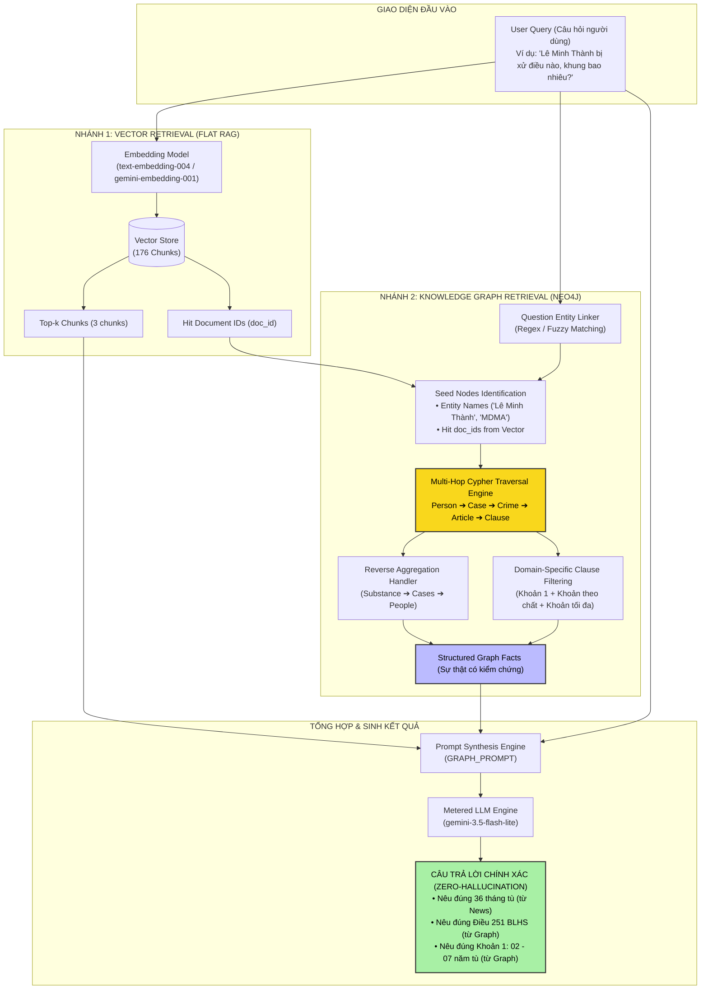
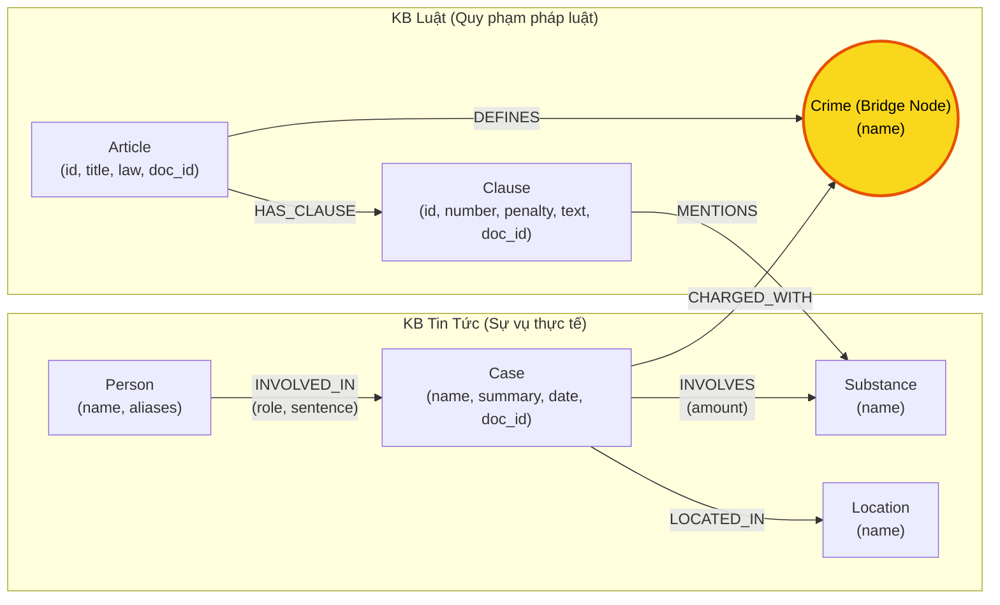

# TÀI LIỆU DỰ ÁN TOÀN DIỆN: KIẾN TRÚC VÀ GIẢI PHÁP HYBRID GRAPHRAG TRÊN DỮ LIỆU PHÁP LÝ & BÁO CHÍ
> **Dự án:** Knowledge Graph RAG: Flat RAG vs GraphRAG Benchmark (Day 19)  
> **Tác giả:** Nguyễn Phương Nam — MSSV: 2A202602869  
> **Cơ sở hạ tầng:** Python 3.11, Neo4j Graph Database, Google Gemini 3.5 Flash Lite, Vector Store

---

## MỤC LỤC
1. [TỔNG QUAN DỰ ÁN & BỐI CẢNH NGHIỆP VỤ](#1-tổng-quan-dự-án--bối-cảnh-nghiệp-vụ)
2. [VẤN ĐỀ CỐT LÕI: VÌ SAO FLAT RAG TRUYỀN THỐNG THẤT BẠI?](#2-vấn-đề-cốt-lõi-vì-sao-flat-rag-truyền-thống-thất-bại)
3. [GIẢI PHÁP TỔNG THỂ: KIẾN TRÚC HYBRID GRAPHRAG](#3-giải-pháp-tổng-thể-kiến-trúc-hybrid-graphrag)
4. [THIẾT KẾ ONTOLOGY & CƠ CHẾ CẦU NỐI (BRIDGE NODE)](#4-thiết-kế-ontology--cơ-chế-cầu-nối-bridge-node)
5. [PIPELINE TRÍCH XUẤT TRI THỨC LAI (HYBRID EXTRACTION PIPELINE)](#5-pipeline-trích-xuất-tri-thức-lai-hybrid-extraction-pipeline)
6. [CƠ CHẾ TRUY XUẤT ĐỒ THỊ ĐA BƯỚC (MULTI-HOP CYPHER RETRIEVAL)](#6-cơ-chế-truy-xuất-đồ-thị-đa-bước-multi-hop-cypher-retrieval)
7. [KẾT QUẢ THỰC NGHIỆM ĐỐI ĐẦU & ĐÁNH ĐỔI KINH TẾ - KỸ THUẬT](#7-kết-quả-thực-nghiệm-đối-đầu--đánh-đổi-kinh-tế---kỹ-thuật)
8. [CHẨN ĐOÁN CÁC LỖI ĐIỂN HÌNH (ERROR DIAGNOSIS)](#8-chẩn-đoán-các-lỗi-điển-hình-error-diagnosis)
9. [HƯỚNG DẪN CẤU TRÚC CODE & VẬN HÀNH THỬ NGHIỆM](#9-hướng-dẫn-cấu-trúc-code--vận-hành-thử-nghiệm)
10. [KẾT LUẬN & ĐỊNH HƯỚNG MỞ RỘNG TRONG SẢN XUẤT (PRODUCTION)](#10-kết-luận--định-hướng-mở-rộng-trong-sản-xuất-production)

---

## 1. TỔNG QUAN DỰ ÁN & BỐI CẢNH NGHIỆP VỤ

### 1.1. Bối cảnh
Hệ thống **Retrieval-Augmented Generation (RAG)** là tiêu chuẩn thực tế để bổ sung dữ liệu độc quyền hoặc mới nhất cho các Mô hình Ngôn ngữ Lớn (LLM) mà không cần huấn luyện lại (fine-tuning). Tuy nhiên, kiến trúc RAG cổ điển—thường gọi là **Flat RAG** (hay Chunk-and-Embed RAG)—dựa hoàn toàn trên việc chia nhỏ văn bản thành các đoạn (chunks), nhúng vector (embedding), và tìm kiếm tương đồng vector (Cosine / Semantic Similarity).

Quy trình này giải quyết rất tốt các câu hỏi cục bộ (Local Single-hop Queries)—nơi câu trả lời nằm trọn vẹn trong một đoạn văn bản ngắn. Nhưng khi triển khai vào các hệ thống chuyên sâu như **Tài chính, Y tế, Quản trị rủi ro**, và đặc biệt là **Pháp lý hình sự**, dữ liệu luôn bị phân tách thành nhiều **Silo tri thức độc lập**.

### 1.2. Dữ liệu của Dự án
Dự án này làm việc trên hai nguồn dữ liệu (Knowledge Base - KB) hoàn toàn tách biệt về nghiệp vụ phòng chống tội phạm ma túy tại Việt Nam:

```
┌────────────────────────────────────────────────────────┐
│            CƠ SỞ DỮ LIỆU ĐỘC LẬP (SILOS)               │
├──────────────────────────┬─────────────────────────────┤
│  KB 1: VĂN BẢN QUY PHẠM  │  KB 2: BÁO CHÍ THỰC TẾ      │
│  (data/drug_law/)        │  (data/drug_news/)          │
├──────────────────────────┼─────────────────────────────┤
│ • 18 Điều luật Markdown  │ • 20 Bài báo Tuổi Trẻ       │
│ • BLHS 2015 Chương XX    │ • Các chuyên án ma túy lớn  │
│ • Luật PCMT 2021         │ • Thông tin đối tượng       │
│                          │                             │
│ Nội dung:                │ Nội dung:                   │
│ - Tên điều, khoản, điểm  │ - Họ tên, tuổi, biệt danh   │
│ - Khung hình phạt        │ - Hành vi, tang vật, số kg  │
│ - Tình tiết định khung   │ - Mức án tòa tuyên thực tế  │
│                          │                             │
│ ĐẶC TÍNH:                │ ĐẶC TÍNH:                   │
│ Không chứa tên bị can,   │ Không trích dẫn toàn văn    │
│ không có vụ án đời thực! │ điều luật & khung cơ bản!   │
└──────────────────────────┴─────────────────────────────┘
```

---

## 2. VẤN ĐỀ CỐT LÕI: VÌ SAO FLAT RAG TRUYỀN THỐNG THẤT BẠI?

### 2.1. Điểm nghẽn 1: Phân mảnh thông tin liên nguồn (Cross-KB Fragmentation)

Hãy xét một câu hỏi nghiệp vụ điều tra / pháp lý điển hình:
> **Câu hỏi (Q3):** *"Lê Minh Thành bị tuyên bao nhiêu tháng tù, về tội gì, và tội đó được quy định tại điều nào của Bộ luật Hình sự với khung hình phạt cơ bản bao nhiêu?"*

Để đưa ra câu trả lời đầy đủ, hệ thống buộc phải có 4 thông tin:
1. **Mức án đã tuyên:** `36 tháng tù` $\rightarrow$ Nằm trong bài báo `news-02.md`.
2. **Tội danh thực tế:** `Mua bán trái phép chất ma túy` $\rightarrow$ Nằm trong bài báo `news-02.md`.
3. **Điều luật quy định:** `Điều 251 BLHS` $\rightarrow$ Nằm trong văn bản luật `blhs-dieu-251.md`.
4. **Khung hình phạt cơ bản:** `Khoản 1: Phạt tù từ 02 năm đến 07 năm` $\rightarrow$ Nằm trong văn bản luật `blhs-dieu-251.md`.

```
        ┌───────────────────────────────────────────────────────────┐
        │                        CÂU HỎI                            │
        │      "Lê Minh Thành bị xử tội gì, Điều nào, khung bao nhiêu?"     │
        └─────────────────────────────┬─────────────────────────────┘
                                      │
              ┌───────────────────────┴───────────────────────┐
              ▼                                               ▼
    [KB Tin Tức (Báo chí)]                          [KB Luật (BLHS 2015)]
    - Lê Minh Thành: 36 tháng tù                    - Điều 251: Mua bán ma túy
    - Tội: mua bán trái phép ma túy                 - Khoản 1: 02 - 07 năm tù
              │                                               │
              └───────────────────────┬───────────────────────┘
                                      ▼
             THỰC TẾ: KHÔNG CÓ BẤT KỲ ĐOẠN VĂN BẢN (CHUNK) NÀO
           CHỨA ĐỒNG THỜI CẢ "LÊ MINH THÀNH" VÀ "ĐIỀU 251 KHOẢN 1"!
```

### 2.2. Điểm nghẽn 2: Thất bại của Tìm kiếm Tương đồng Ngữ nghĩa (Vector Search Failure)
Khi câu hỏi trên được đưa vào Flat RAG:
1. Phép tìm kiếm vector đo khoảng cách ngữ nghĩa giữa vector của câu hỏi và vector của các chunk.
2. Từ khóa cá biệt hóa cao nhất là **"Lê Minh Thành"**. Các chunk trích đoạn bài báo của Lê Minh Thành có độ tương đồng áp đảo.
3. Top-$k$ chunks trả về cho LLM **hoàn toàn là bài báo**, không có bất kỳ chunk nào của Điều 251 BLHS.
4. Trong bài báo, phóng viên chỉ ghi: *"bị tuyên 36 tháng tù về tội mua bán trái phép chất ma túy"*, không hề nêu khung hình phạt gốc của Bộ luật Hình sự.
5. **Hậu quả kép:**
   - **Nếu Prompt nghiêm ngặt (Strict RAG):** LLM buộc phải trả lời: *"Tài liệu được cung cấp không đề cập đến Điều luật và khung hình phạt cơ bản"* (Đúng với kết quả Flat RAG ở Benchmark: Recall tụt xuống 0.33).
   - **Nếu Prompt lỏng:** LLM sẽ rơi vào bẫy **Ảo giác (Hallucination)**: tự bịa ra điều luật hoặc đoán mò khung hình phạt dựa vào trí nhớ mờ nhạt từ pre-training.

### 2.3. Điểm nghẽn 3: Thất bại trong các câu hỏi gom nhóm / tổng hợp (Aggregation Queries)
Hãy xét câu hỏi Q6:
> **Câu hỏi (Q6):** *"Những vụ việc nào trong tin tức có liên quan đến ma túy MDMA?"*

- **Bản chất của Vector Search:** Tìm top-$k$ đoạn văn bản tương tự nhất. Nó chỉ lấy được 3 đoạn ngẫu nhiên có chữ "MDMA", hoàn toàn không có khả năng duyệt qua toàn bộ kho dữ liệu (Global traversal) để gom nhóm (GROUP BY).
- **Hệ quả:** Flat RAG đạt `Recall = 0.00` do chỉ điểm mặt được các đoạn rời rạc mà bỏ sót các vụ án và nhân vật trọng yếu.

---

## 3. GIẢI PHÁP TỔNG THỂ: KIẾN TRÚC HYBRID GRAPHRAG

Để giải quyết triệt để vấn đề phân mảnh tri thức liên nguồn, repo xây dựng giải pháp **Hybrid GraphRAG** kết hợp sức mạnh bổ trợ giữa Vector Database và Knowledge Graph (Neo4j).

### 3.1. Sơ đồ Kiến trúc Tổng thể



### 3.2. Triết lý Thiết kế: "Never worse than Flat RAG"
- **Không thay thế, mà kế thừa:** GraphRAG giữ nguyên toàn bộ ngữ cảnh Vector Search (top-3 chunks) đưa vào prompt. Nhờ đó, với những câu hỏi cục bộ đơn giản (Single-hop), hệ thống có chất lượng ít nhất là bằng Flat RAG.
- **Mở rộng bằng đồ thị (Graph Expansion):** Hệ thống dùng các `doc_id` của các chunk tìm được làm "hạt giống" (Seed Nodes) để bước lên đồ thị Neo4j, từ đó duyệt qua các cạnh quan hệ sang KB đối ứng.

---

## 4. THIẾT KẾ ONTOLOGY & CƠ CHẾ CẦU NỐI (BRIDGE NODE)

Đồ thị tri thức không thể xây dựng bừa bãi. Việc định hình **Ontology** (mô hình dữ liệu đồ thị) quyết định liệu các truy vấn có hội tụ hay gây bùng nổ đường đi.

### 4.1. Sơ đồ Thực thể và Quan hệ (Ontology Graph)



### 4.2. Danh mục 7 Nhãn Node (Node Labels) & Thuộc tính

| Node Label | Mô tả nghiệp vụ | Khóa duy nhất (`MERGE`) | Các thuộc tính lưu trữ | Thuộc KB |
| :--- | :--- | :--- | :--- | :--- |
| `Article` | Điều luật trong văn bản quy phạm pháp luật | `id` ("Điều 251 BLHS") | `id`, `title`, `law`, `doc_id` | Luật |
| `Clause` | Khoản luật quy định khung hình phạt chi tiết | `id` ("Điều 251 BLHS khoản 1") | `id`, `number`, `penalty`, `text`, `doc_id` | Luật |
| `Crime` | **Node Cầu Nối:** Tội danh chuẩn hóa | `name` ("mua bán trái phép chất ma túy") | `name` | Dùng chung |
| `Case` | Vụ án / Chuyên án ma túy được báo chí đưa tin | `name` ("Vụ mua bán 36kg ma túy tại TP.HCM") | `name`, `summary`, `date`, `doc_id`, `source_title` | Tin tức |
| `Person` | Cá nhân bị can, bị cáo, nghi phạm, đối tượng | `name` ("Lê Minh Thành") | `name`, `aliases` | Tin tức |
| `Substance` | Tên chất ma túy, tiền chất, cây thuốc phiện | `name` ("MDMA", "Heroine", "Methamphetamine") | `name` | Dùng chung |
| `Location` | Tỉnh / Thành phố diễn ra hành vi hoặc xét xử | `name` ("Hà Nội", "TP.HCM") | `name` | Tin tức |

### 4.3. Phân tích Chiến lược: Tại sao chọn `Crime` làm Node Cầu Nối thay vì `Substance`?

Trong đồ thị tri thức đa nguồn, lựa chọn nút liên kết quyết định độ phức tạp tính toán và độ nhiễu:

* **Trường hợp nếu chọn `Substance` làm cầu nối:**
  - Một chất ma túy phổ biến (như *Heroine* hay *MDMA*) xuất hiện ở hầu như **tất cả** các điều luật trong Chương XX BLHS: Điều 249 (Tàng trữ), Điều 250 (Vận chuyển), Điều 251 (Mua bán), Điều 252 (Chiếm đoạt), Điều 255 (Tổ chức sử dụng), Điều 256 (Chứa chấp)...
  - Khi một vụ án liên quan đến MDMA, nếu đi qua nút `Substance`, đồ thị sẽ bị **bùng nổ đường đi (path explosion)** sang đồng loạt 5-6 điều luật. Hệ thống không thể biết vụ án cụ thể đó bị truy tố theo tội danh nào, dẫn đến nhiễu loạn thông tin nghiêm trọng.
* **Quyết định tối ưu: Chọn `Crime` làm cầu nối:**
  - Trong quy trình tố tụng, cơ quan điều tra luôn khởi tố vụ án theo một **tội danh cụ thể** (`Case -[:CHARGED_WITH]-> Crime`).
  - Trong cấu trúc Bộ luật Hình sự, mỗi tội danh được định nghĩa tại **đúng 01 Điều luật duy nhất** (`Article -[:DEFINES]-> Crime`).
  - Đường đi:
    $$\text{Person} \longrightarrow \text{Case} \longrightarrow \text{Crime} \longleftarrow \text{Article} \longrightarrow \text{Clause}$$
    là một ánh xạ đơn ánh (1-to-1 mapping), bảo đảm tính tất định và chính xác tuyệt đối khi suy luận.

---

## 5. PIPELINE TRÍCH XUẤT TRI THỨC LAI (HYBRID EXTRACTION PIPELINE)

Để tối ưu hóa chi phí API và độ chính xác, hệ thống áp dụng kỹ thuật trích xuất lai:

```
Văn bản Luật (Định dạng chuẩn) ──[Deterministic Regex Engine]──> Article, Clause, DEFINES, MENTIONS (Chi phí: $0, Thời gian: <0.1s)
Văn bản Báo chí (Văn xuôi tự do) ─[LLM JSON Extraction + Fuzzy]─> Case, Person, CHARGED_WITH, INVOLVES (Chi phí: $0.004)
```

### 5.1. Trích xuất KB Luật bằng Regex (Rule-based)
- Cấu trúc văn bản luật cực kỳ chặt chẽ: Các Điều bắt đầu bằng `Điều \d+`, các khoản bắt đầu bằng `^(\d+)\.`, khung hình phạt luôn chứa cụm *"thì bị phạt tù từ ... đến ..."* hoặc *"phạt tù chung thân hoặc tử hình"*.
- **Cài đặt:** Dùng regex thuần túy phân tích 18 điều luật thành hàng trăm node và quan hệ chỉ trong 0.05 giây, không tiêu tốn token LLM, đảm bảo tính tất định 100%.

### 5.2. Trích xuất KB Tin tức bằng LLM & Cơ chế Khử nhiễu Thực thể (`link_entity`)
Văn phong báo chí thường không đồng nhất:
- Phóng viên viết: *"khởi tố về tội Mua bán trái phép chất ma tuý"*, *"hành vi vận chuyển ma túy"*, *"vụ án mua bán ma túy đá"*.
- Tên chuẩn trong Bộ luật Hình sự: *"mua bán trái phép chất ma túy"*.

Nếu so khớp chuỗi chính xác (`string == string`), hai node sẽ không nhập vào nhau, khiến **node cầu nối bị tách đôi và đồ thị bị đứt gãy hoàn toàn**.

Hàm `link_entity(name, known, normalize=normalize_crime)` giải quyết vấn đề qua 2 tầng:
1. **Tầng 1 - Chuẩn hóa (Normalization):** Đưa về chữ thường, bỏ khoảng trắng thừa, xóa dấu ngoặc kép, gọt bỏ tiền tố `"tội "`/`"Tội "`.
2. **Tầng 2 - So khớp mờ (Fuzzy String Matching):** Sử dụng thuật toán `difflib.get_close_matches` với ngưỡng tương đồng nghiêm ngặt `cutoff = 0.8`. Bắt trọn vẹn các biến thể lệch dấu kiểu gõ tiếng Việt (như `tuý` vs `túy`) hoặc cách gọi rút gọn. Nếu độ tương đồng dưới 0.8, hàm trả về `None` để tránh nối nhầm tội danh.

---

## 6. CƠ CHẾ TRUY XUẤT ĐỒ THỊ ĐA BƯỚC (MULTI-HOP CYPHER RETRIEVAL)

Khi nhận câu hỏi từ người dùng, phương thức `Neo4jGraph.context(question, doc_ids)` thực hiện quy trình 4 chặng:

### Chặng 1: Tìm kiếm Node Hạt giống (Seed Nodes)
Hệ thống xác định các điểm neo ban đầu trên đồ thị dựa vào:
- Danh sách `doc_id` của các đoạn văn bản do Vector Search tìm được.
- Thực thể xuất hiện trực tiếp trong câu hỏi (tên đối tượng như "Lê Minh Thành", "Hoàng Nato", hoặc tên chất như "MDMA").

### Chặng 2: Thu thập Thông tin Vụ án (Case & Suspects)
```cypher
MATCH (k:Case)
WHERE elementId(k) IN $ids OR EXISTS { MATCH (s)--(k) WHERE elementId(s) IN $ids }
OPTIONAL MATCH (p:Person)-[inv:INVOLVED_IN]->(k)
OPTIONAL MATCH (k)-[inv_sub:INVOLVES]->(sub:Substance)
RETURN elementId(k) AS id, k.name AS name, k.summary AS summary,
       collect(DISTINCT p.name) AS people,
       collect(DISTINCT sub.name) AS substances
```

### Chặng 3: Nhảy qua Nút Cầu Nối sang KB Luật (Cross-KB Jump)
Từ vụ án, lần theo quan hệ `CHARGED_WITH` đến `Crime`, đi ngược `DEFINES` về `Article` và mở rộng ra các `Clause`:
```cypher
MATCH (k:Case)-[:CHARGED_WITH]->(c:Crime)<-[:DEFINES]-(a:Article)-[:HAS_CLAUSE]->(cl:Clause)
WHERE elementId(k) IN $case_ids
OPTIONAL MATCH (k)-[:INVOLVES]->(s:Substance)<-[:MENTIONS]-(cl)
WITH a, cl, count(s) AS matching_substances
RETURN DISTINCT a.id AS article_id, a.title AS title, 
                cl.number AS number, cl.penalty AS penalty, cl.text AS text,
                matching_substances
ORDER BY a.id, cl.number
```

**Chiến lược lọc khoản luật thông minh (Smart Clause Filtering):**
Một Điều luật có thể có 5-7 khoản với hàng chục tình tiết định khung dài hàng nghìn chữ. Để không làm tràn context window của LLM:
1. **Luôn giữ Khoản 1:** Quy định khung hình phạt cơ bản khi không có tình tiết tăng nặng.
2. **Giữ các Khoản có `matching_substances > 0`:** Các khoản quy định đúng loại ma túy mà vụ án đó thu giữ.
3. **Giữ Khoản có hình phạt cao nhất:** Để phục vụ các câu hỏi về khung hình phạt tối đa.

### Chặng 4: Truy vết Đảo chiều phục vụ Aggregation (Reverse Traversal)
Nếu câu hỏi nhắc đến tên một chất (ví dụ Q6: "MDMA"), đồ thị truy vấn ngược từ nút chất:
```cypher
MATCH (k:Case)-[:INVOLVES]->(sub:Substance)
WHERE toLower(sub.name) = toLower($q_substance)
OPTIONAL MATCH (p:Person)-[inv:INVOLVED_IN]->(k)
RETURN k.name AS name, k.summary AS summary, collect(DISTINCT p.name) AS people
```
Dữ kiện này giúp hệ thống trả lời toàn diện mọi vụ án liên quan mà không một vector search nào làm được.

---

## 7. KẾT QUẢ THỰC NGHIỆM ĐỐI ĐẦU & ĐÁNH ĐỔI KINH TẾ - KỸ THUẬT

Hệ thống được đánh giá thực nghiệm toàn diện thông qua lệnh benchmark chuẩn `python bench_kg.py --judge` trên đồ thị hoàn chỉnh gồm **206 nodes** và **387 relationships**.

### 7.1. Bảng Đo đạc Chi phí & Độ trễ Thực tế

#### A. Pha Xây dựng Chỉ mục (Indexing — Chi phí một lần)
| Chỉ số | Flat RAG | GraphRAG | So sánh (Graph / Flat) |
| :--- | :---: | :---: | :---: |
| **Số cuộc gọi LLM/Embed** | 176 | 196 | +20 calls (Trích xuất 20 bài báo) |
| **Input Tokens** | 0 | 34,619 | +34,619 tokens |
| **Output Tokens** | 0 | 5,778 | +5,778 tokens |
| **Chi phí Indexing (USD)** | **$0.00000** | **$0.00433** | **+0.00433 USD (~110 VNĐ)** |
| **Thời gian chạy** | 116.6 giây | 152.6 giây | **1.31×** |

#### B. Pha Truy vấn (Querying — Tính trung bình trên mỗi câu hỏi)
| Chỉ số | Flat RAG | GraphRAG | Cải thiện / Đánh đổi |
| :--- | :---: | :---: | :---: |
| **Độ phủ từ khóa (Keyword Recall)** | 0.51 (51%) | **0.94 (94%)** | **+84% (Vượt trội)** |
| **Điểm LLM Judge (Thang 0-2)** | 1.33 / 2.0 | **1.83 / 2.0** | **+37.6% (Chất lượng cao)** |
| **Input Tokens trung bình** | 696 | 5,701 | 8.19× (Prompt phong phú hơn) |
| **Output Tokens trung bình** | 69 | 172 | 2.49× (Trả lời chi tiết, căn cứ rõ) |
| **Chi phí mỗi câu hỏi** | **$0.00007** | **$0.00048** | **6.86×** |
| **Thời gian phản hồi (Latency)** | **1.60 giây** | **2.56 giây** | **1.60×** |

---

### 7.2. So sánh Đối đầu Trực diện trên 6 Câu hỏi Benchmark (Q1 - Q6)

```mermaid
gantt
    title So sánh Keyword Recall giữa Flat RAG và GraphRAG
    dateFormat X
    axisFormat %s

    section Q1: Định nghĩa tiền chất (Law)
    Flat RAG (1.00)       :done, 0, 100
    GraphRAG (1.00)       :active, 0, 100

    section Q2: Hai án tử hình vụ 36kg (News)
    Flat RAG (1.00)       :done, 0, 100
    GraphRAG (1.00)       :active, 0, 100

    section Q3: Lê Minh Thành (Cross-KB)
    Flat RAG (0.33)       :done, 0, 33
    GraphRAG (1.00)       :active, 0, 100

    section Q4: Giang hồ Hoàng Nato (Cross-KB)
    Flat RAG (0.33)       :done, 0, 33
    GraphRAG (0.67)       :active, 0, 67

    section Q5: Vụ 9.6kg MDMA (Multi-hop)
    Flat RAG (0.40)       :done, 0, 40
    GraphRAG (1.00)       :active, 0, 100

    section Q6: Các vụ án MDMA (Aggregation)
    Flat RAG (0.00)       :done, 0, 0
    GraphRAG (1.00)       :active, 0, 100
```



| Câu hỏi | Phân loại | Flat Recall / Judge | Graph Recall / Judge | Bên thắng | Phân tích bản chất kỹ thuật |
| :--- | :--- | :---: | :---: | :---: | :--- |
| **Q1** | `single-hop-law` | 1.00 / 2 | 1.00 / 2 | **Hòa** | Định nghĩa tiền chất nằm trọn trong Điều 2 Luật PCMT 2021. Cả hai hệ thống đều tìm trúng chunk văn bản gốc. |
| **Q2** | `single-hop-news` | 1.00 / 2 | 1.00 / 2 | **Hòa** | Tên 2 bị can tử hình (Trần Thanh Tuấn, Trần Minh Tâm) nằm gọn trong bài báo `news-01.md`. Vector search hoạt động hoàn hảo. |
| **Q3** | `cross-kb` | 0.33 / 1 | **1.00 / 2** | **GraphRAG** | **Flat RAG thất bại:** Tìm được tin tức nhưng đầu hàng trước điều luật. **GraphRAG thắng:** Đi qua cầu nối sang Điều 251 BLHS khoản 1 (02–07 năm tù). |
| **Q4** | `cross-kb` | 0.33 / 1 | **0.67 / 1** | **GraphRAG** | Flat RAG chỉ biết Hoàng Nato phạm tội tổ chức sử dụng ma túy. GraphRAG nối sang đúng Điều 255 BLHS. |
| **Q5** | `cross-kb-multi-hop` | 0.40 / 1 | **1.00 / 2** | **GraphRAG** | Flat RAG không biết mức phạt cho >9.6kg MDMA. GraphRAG đối chiếu khối lượng >500g MDMA với Khoản 4 Điều 250 (20 năm, chung thân hoặc tử hình). |
| **Q6** | `aggregation` | 0.00 / 1 | **1.00 / 2** | **GraphRAG** | Flat RAG chỉ gọi tên vu vơ "Vụ việc [1], [2], [3]". GraphRAG truy vết đồ thị trả về đầy đủ 3 chuyên án và mọi nhân vật liên quan. |

---

## 8. CHẨN ĐOÁN CÁC LỖI ĐIỂN HÌNH (ERROR DIAGNOSIS)

Knowledge Graph không phải là "viên đạn bạc" hoàn hảo. Dự án đã phát hiện và phân tích sâu sắc 2 nhóm lỗi điển hình:

### 8.1. Lỗi E2: Thiếu Ngữ cảnh Luật khi Định khung theo Hậu quả (Missing Legal Context)
* **Hiện tượng:** Ở câu Q4, hệ thống hỏi mức phạt tù tối đa của Hoàng Nato. GraphRAG đạt `Recall = 0.67` và `Judge = 1`, trả lời rằng *"Ngữ cảnh chỉ có Khoản 1 và Khoản 2, không đủ dữ kiện để khẳng định mức phạt tối đa"*.
* **Bằng chứng kiểm chứng:**
  Truy vấn kiểm tra các khoản của Điều 255 trên Neo4j:
  ```cypher
  MATCH (a:Article {id: "Điều 255 BLHS"})-[:HAS_CLAUSE]->(cl:Clause)
  OPTIONAL MATCH (cl)-[:MENTIONS]->(s:Substance)
  RETURN cl.number, cl.penalty, count(s) AS num_substances
  ORDER BY cl.number
  ```
  Kết quả cho thấy: Khoản 4 (mức phạt cao nhất: tù chung thân) không hề chứa tên chất ma túy nào (`num_substances = 0`), vì điều luật này định khung theo **hậu quả** (*"làm chết 02 người trở lên"*).
* **Nguyên nhân:** Thuật toán lọc khoản chỉ lấy Khoản 1 và các khoản nhắc đến chất ma túy của vụ án, vô tình bỏ sót Khoản 4 khỏi prompt.
* **Biện pháp khắc phục:** Với các Điều luật ngắn ($\le 5$ khoản), đưa toàn bộ các khoản vào context hoặc luôn truy xuất thêm Khoản có số thứ tự lớn nhất (`ORDER BY cl.number DESC LIMIT 1`).

### 8.2. Lỗi E4: Điểm mù của Phép đo Keyword Recall so với LLM Judge
* **Hiện tượng:** Ở câu Q6, Flat RAG đạt `Recall = 0.00` nhưng vẫn được LLM Judge chấm `Judge = 1`.
* **Nguyên nhân kỹ thuật:** Phép đo `keyword_recall` là so khớp chuỗi con cơ học (`k.lower() in answer.lower()`). Flat RAG thực chất đã tìm được 3 đoạn văn bản đúng về 3 vụ việc, nhưng LLM diễn đạt theo số thứ tự tài liệu (*"Vụ việc [1], Vụ việc [2]"*) mà không chép lại họ tên đầy đủ `["Cái Quang Huy", "Lê Minh Thành", "Pháp y tâm thần"]`. Phép kiểm tra từ khóa máy móc đã phạt 0 điểm.
* **Bài học rút ra:** Luôn kết hợp song song cả hai thước đo: Keyword Recall (định lượng nghiêm ngặt) và LLM Judge (định tính ngữ nghĩa có rubric rõ ràng).

---

## 9. HƯỚNG DẪN CẤU TRÚC CODE & VẬN HÀNH THỬ NGHIỆM

### 9.1. Cấu trúc Thư mục Dự án

```
.
├── src/
│   ├── graph.py               ← Triển khai 4 TODOs cốt lõi: KG-1, KG-2, KG-3, KG-4
│   ├── llm.py                 ← Wrapper LLM đo đạc chi phí + cơ chế Retry Exponential Backoff
│   ├── store.py               ← In-memory / Chroma Vector Store
│   ├── chunking.py            ← Bộ chia nhỏ tài liệu theo ký tự (Recursive Chunker)
│   ├── agent.py               ← KnowledgeBaseAgent (Baseline Flat RAG)
│   └── models.py              ← Định nghĩa Document, Usage, Cost dataclasses
├── data/
│   ├── drug_law/              ← 18 Điều luật Markdown (BLHS 2015 & PCMT 2021)
│   ├── drug_news/             ← 20 Bài báo Tuổi Trẻ về các vụ án ma túy
│   └── benchmark_kg.json      ← Bộ đề 6 câu hỏi chuẩn kèm gold keywords và rubric
├── report/
│   ├── ONTOLOGY.md            ← Bản đặc tả thiết kế Ontology & Competency Questions
│   ├── REPORT_KG.md           ← Báo cáo đánh giá khoa học kèm số liệu thực nghiệm
│   └── img/
│       ├── kg_count.png       ← Ảnh chụp giao diện Neo4j: Thống kê số lượng node (206 nodes)
│       ├── kg_cross_kb.png    ← Ảnh chụp giao diện Neo4j: Đường đi xuyên 2 KB
│       └── kg_my_case.png     ← Ảnh chụp giao diện Neo4j: Vụ án Cái Quang Huy
├── tests/
│   ├── test_base.py           ← 41 unit tests cho Flat RAG (Passed)
│   └── test_graph.py          ← 7 unit tests cho LinkEntity và GraphRAGAgent (Passed)
├── bench_kg.py                ← Script tự động hóa đo đạc benchmark và chấm điểm
├── ket_qua_benchmark_kg.txt   ← Báo cáo kết quả benchmark sinh ra từ hệ thống
└── docs/
    └── PROJECT_DEEP_DIVE.md   ← Tài liệu phân tích chuyên sâu (Tài liệu này)
```

### 9.2. Hướng dẫn Lệnh Chạy Thực tế

```bash
# 1. Khởi động cơ sở dữ liệu Neo4j qua Docker
docker run -d --name neo4j-drug-kg -p 7474:7474 -p 7687:7687 -e NEO4J_AUTH=neo4j/password123 neo4j:latest

# 2. Chạy toàn bộ 48 Unit Tests kiểm tra tính toàn vẹn mã nguồn
pytest tests/ -q
# Kết quả kỳ vọng: 48 passed in 0.xx s

# 3. Kiểm tra hợp đồng triển khai (Contract check với 1 bài báo mẫu)
python bench_kg.py --check
# Kết quả kỳ vọng: Đủ 7 dòng [OK], không có dòng [LỖI] nào

# 4. Chạy toàn bộ quy trình đo đạc Benchmark đối đầu và chấm điểm LLM Judge
python bench_kg.py --judge
# Kết quả sẽ tự động lưu vào file `ket_qua_benchmark_kg.txt`
```

---

## 10. KẾT LUẬN & ĐỊNH HƯỚNG MỞ RỘNG TRONG SẢN XUẤT (PRODUCTION)

### 10.1. Khi nào Doanh nghiệp Nên Dùng GraphRAG?
1. **Nên đầu tư GraphRAG khi:**
   - Dữ liệu bị **phân mảnh qua nhiều hệ thống (Multi-silo)**: CRM khách hàng $\leftrightarrow$ Hợp đồng pháp lý $\leftrightarrow$ Quy định nội bộ.
   - Bài toán nghiệp vụ bắt buộc phải **suy luận bắc cầu (Multi-hop Reasoning)** qua 2-3 thực thể trung gian.
   - Yêu cầu tính **minh bạch và giải trình nguồn gốc (Explainability & Provenance)**: Mỗi dữ kiện trả lời đều có thể vẽ ra đường đi từ Node A sang Node B trên đồ thị để người dùng kiểm chứng.
   - Cần các câu hỏi **tổng hợp toàn cục (Global Aggregation)**: *"Liệt kê tất cả các vụ việc liên quan đến X"*.
2. **Nên dừng lại ở Flat RAG khi:**
   - Dữ liệu là các tài liệu văn bản độc lập, nội dung khép kín trong từng tài liệu (ví dụ: cẩm nang hướng dẫn sử dụng sản phẩm, blog, tin tức giải trí).
   - Ngân sách cực thấp hoặc yêu cầu độ trễ cực nhanh (< 1 giây).

### 10.2. Lộ trình Nâng cấp trong Môi trường Thực tế
- **Entity Resolution thông minh:** Sử dụng các mô hình ngôn ngữ chuyên sâu cho tiếng Việt (như PhoBERT / ViDeBERTa) để tự động nhận diện từ lóng và biến thể ma túy ("kẹo", "lắc", "đá", "khay").
- **Đại số Định lượng trên Graph:** Mô hình hóa các điều kiện so sánh định lượng trực tiếp trong Cypher (`WHERE k.amount >= cl.min_weight AND k.amount < cl.max_weight`) thay vì đẩy text thô cho LLM suy luận.
- **Hierarchical Leiden Communities (Microsoft GraphRAG Style):** Phân cụm đồ thị theo cộng đồng để sinh các bản tóm tắt vĩ mô, cho phép trả lời các câu hỏi toàn cảnh: *"Xu hướng tội phạm ma túy tại Việt Nam trong năm qua có những đặc điểm nổi bật gì?"*.
