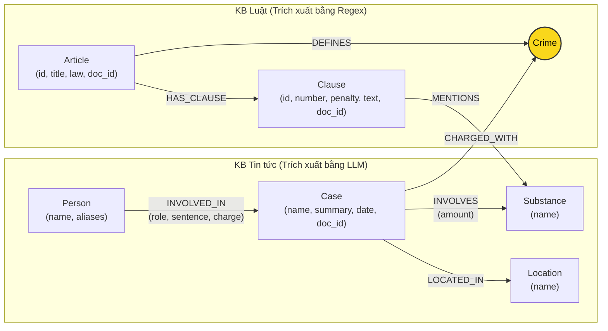

# Thiết kế Ontology — Day 19

**Họ tên:** Nguyễn Phương Nam  **MSSV:** 2A202602869

**Lựa chọn** (đánh dấu một):
- [x] Dùng ontology gợi ý (có thể chỉnh nhỏ)
- [ ] Tự thiết kế (xét bonus +15, xem `SUBMISSION.md`)

> Hướng dẫn: `LAB_GUIDE.md` Bước 2. Dùng ontology gợi ý thì vẫn phải điền đủ các mục dưới đây bằng lời của bạn.

## 1. Sơ đồ

Sơ đồ Knowledge Graph liên kết 2 cơ sở tri thức: **KB Luật** (BLHS 2015 Chương XX & Luật Phòng chống ma túy 2021) và **KB Tin tức** (20 bài báo Tuổi Trẻ về các vụ án ma túy). Node cầu nối trung tâm liên kết 2 KB là **Crime** (Tội danh).

## 2. Entity types (node labels)

| Label | Ý nghĩa | Khóa định danh (`MERGE` theo) | Properties | Lấy từ KB nào | Trích bằng (regex / LLM / khác) |
| --- | --- | --- | --- | --- | --- |
| `Article` | Điều luật trong văn bản quy phạm pháp luật (BLHS, Luật PCMT) | `id` ("Điều 251 BLHS") | `id`, `title`, `law`, `doc_id` | KB Luật | Regex (`parse_law_article`) |
| `Clause` | Khoản cụ thể trong một Điều luật, chứa khung hình phạt và tình tiết | `id` ("Điều 251 BLHS khoản 1") | `id`, `number`, `penalty`, `text`, `doc_id` | KB Luật | Regex (`parse_law_article`) |
| `Crime` | **Node cầu nối**: Tội danh chuẩn hóa theo quy định pháp luật | `name` (tên chuẩn hóa chữ thường, bỏ "tội ") | `name` | Cả hai KB | Regex (Luật) & LLM + `link_entity` (Tin tức) |
| `Case` | Vụ án / chuyên án ma túy cụ thể được phản ánh trên báo chí | `name` | `name`, `summary`, `date`, `doc_id`, `source_title` | KB Tin tức | LLM (`extract_news_cases`) |
| `Substance` | Tên chất ma túy hoặc tiền chất | `name` | `name` | Cả hai KB | Regex (`find_substances` trong Luật) & LLM (Tin tức) |
| `Person` | Cá nhân liên quan vụ án (bị can, bị cáo, đồng phạm, cán bộ...) | `name` | `name`, `aliases` | KB Tin tức | LLM (`extract_news_cases`) |
| `Location` | Tỉnh/thành phố nơi diễn ra hành vi vi phạm hoặc xét xử | `name` | `name` | KB Tin tức | LLM (`extract_news_cases`) |

## 3. Relationships

| Type | Từ → Đến | Properties trên cạnh | Ý nghĩa |
| --- | --- | --- | --- |
| `DEFINES` | `Article → Crime` | Không có | Điều luật hình sự xác lập và định nghĩa tội danh cụ thể |
| `HAS_CLAUSE` | `Article → Clause` | Không có | Một Điều luật bao gồm các khoản quy định khung hình phạt từ nhẹ đến nặng |
| `MENTIONS` | `Clause → Substance` | Không có | Khoản luật đề cập đến chất ma túy để làm căn cứ định lượng mức án |
| `CHARGED_WITH` | `Case → Crime` | Không có | Vụ án được cơ quan điều tra/truy tố/xét xử theo tội danh nào |
| `INVOLVES` | `Case → Substance` | `amount` (khối lượng, đơn vị) | Vụ án liên quan đến chất ma túy nào và số lượng thu giữ |
| `LOCATED_IN` | `Case → Location` | Không có | Địa bàn xảy ra vụ việc hoặc địa phương xét xử vụ án |
| `INVOLVED_IN` | `Person → Case` | `role` (vai trò), `charge` (tội danh cá nhân), `sentence` (mức án) | Đối tượng tham gia vào vụ án với vai trò và mức án cụ thể |

## 4. Node cầu nối giữa 2 KB

- **Node nào:** `Crime` (Tội danh).
- **Vì sao chọn node này:**
  - Trong KB Luật (BLHS), mỗi Điều luật ở Chương XX định nghĩa một tội danh tương ứng (`Article DEFINES Crime`), ví dụ Điều 251 định nghĩa "mua bán trái phép chất ma túy".
  - Trong KB Tin tức, bất kỳ vụ án ma túy nào cũng phản ánh hành vi vi phạm bị cơ quan tiến hành tố tụng khởi tố/truy tố/xét xử theo một tội danh cụ thể (`Case CHARGED_WITH Crime`).
  - `Crime` là điểm giao thoa ngữ nghĩa tự nhiên và chặt chẽ nhất: nối được trực tiếp từ vụ án trong đời thực sang điều luật điều chỉnh trong BLHS mà không bị phân tán (như khi nối qua `Substance`).
- **Cách đảm bảo hai phía khớp tên:**
  1. *Chuẩn hóa chuỗi:* Hàm `normalize_crime` đưa chuỗi về chữ thường, loại bỏ khoảng trắng thừa, xóa dấu ngoặc kép, và lược bỏ tiền tố "tội "/"Tội ".
  2. *Định hướng LLM:* Danh sách toàn bộ các tội danh chuẩn từ 18 điều luật được truyền trực tiếp vào `NEWS_EXTRACTION_PROMPT`, yêu cầu LLM bắt buộc chọn chính xác tội danh từ danh mục.
  3. *Khớp thực thể (`link_entity`):* Áp dụng so khớp chính xác sau chuẩn hóa. Nếu không khớp chính xác, sử dụng thuật toán so khớp mờ `difflib.get_close_matches(..., cutoff=0.8)` để nhận diện các biến thể bỏ dấu tiếng Việt (ví dụ `ma tuý` vs `ma túy`) hoặc sai lệch nhỏ về mặt từ vựng. Nếu không đạt ngưỡng tương đồng 0.8, trả về `None` để tránh liên kết sai lệch.
- **Khi nào cầu gãy, và bạn xử lý thế nào:**
  - *Nguyên nhân gãy:*
    - Bài báo dùng văn phong sinh hoạt, không sử dụng thuật ngữ pháp lý chính thức (ví dụ: "chơi thuốc lắc", "bay lắc", "dùng pod chill").
    - Vụ việc mới bắt quả tang ban đầu, cơ quan công an chưa khởi tố vụ án, chưa xác định tội danh chính thức.
    - LLM diễn đạt tội danh theo cách riêng không khớp với 13 tội danh trong BLHS và vượt ngoài ngưỡng `cutoff=0.8`.
  - *Cách xử lý:*
    - Thiết lập ontology lai (hybrid): khi đi qua `Crime` bị đứt, GraphRAG sử dụng đường phụ thông qua `Substance` mà vụ án liên quan (`Case -> Substance <- Clause`).
    - Kết hợp song song với Vector search (`GraphRAGAgent` truy xuất top-k chunk văn bản gốc), đảm bảo hệ thống không bao giờ thiếu thông tin kể cả khi đường đi trên Graph bị gián đoạn.

## 5. Competency questions

| Câu | Đường đi (Cypher pattern) | Trả lời được? |
| --- | --- | --- |
| Q1 | `(:Article {law: 'Luật Phòng, chống ma túy 2021'})-[:HAS_CLAUSE]->(:Clause)` hoặc trực tiếp từ text khoản định nghĩa tiền chất. | Có (Single-hop Law) |
| Q2 | `(:Person)-[r:INVOLVED_IN]->(k:Case)` WHERE `r.sentence CONTAINS 'tử hình'` | Có (Single-hop News) |
| Q3 | `(:Person {name: 'Lê Minh Thành'})-[:INVOLVED_IN]->(:Case)-[:CHARGED_WITH]->(:Crime)<-[:DEFINES]-(:Article)-[:HAS_CLAUSE]->(:Clause {number: 1})` | Có (Cross-KB: News → Law) |
| Q4 | `(:Person {aliases: ['Hoàng Nato']})-[:INVOLVED_IN]->(:Case)-[:CHARGED_WITH]->(:Crime)<-[:DEFINES]-(:Article)-[:HAS_CLAUSE]->(cl:Clause)` lấy khung hình phạt cao nhất (Khoản 4). | Có (Cross-KB: News → Law) |
| Q5 | `(:Person {name: 'Cái Quang Huy'})-[:INVOLVED_IN]->(k:Case)-[:INVOLVES]->(s:Substance {name: 'MDMA'})` kết hợp `(k)-[:CHARGED_WITH]->(:Crime)<-[:DEFINES]-(a:Article)-[:HAS_CLAUSE]->(cl:Clause)-[:MENTIONS]->(s)` (Khoản 4 Điều 250: tù 20 năm, tù chung thân hoặc tử hình). | Có (Cross-KB Multi-hop) |
| Q6 | `(k:Case)-[:INVOLVES]->(:Substance {name: 'MDMA'})` và `(:Person)-[:INVOLVED_IN]->(k)` | Có (Aggregation) |

## 6. Quyết định thiết kế và đánh đổi

1. **Quyết định 1: Dùng `Crime` làm node cầu nối chính giữa 2 KB thay vì `Substance`.**
   - *Phương án thay thế:* Dùng `Substance` làm cầu nối, vì chất ma túy xuất hiện ở cả tin tức và văn bản luật.
   - *Lý do chọn:* Một chất ma túy (như Heroine hay MDMA) xuất hiện ở hầu hết tất cả các Điều trong BLHS (Điều 249 tàng trữ, Điều 250 vận chuyển, Điều 251 mua bán, Điều 255 tổ chức sử dụng...). Nếu nối qua `Substance`, từ một vụ án sẽ lan ra hàng loạt Điều luật không liên quan (bùng nổ đường đi - path explosion), làm nhiễu ngữ cảnh. Trong khi đó, tội danh (`Crime`) là duy nhất cho mỗi hành vi, dẫn thẳng tới đúng 01 Điều luật áp dụng.

2. **Quyết định 2: Tách cấu trúc văn bản Luật chi tiết tới cấp `Clause` (Khoản) thay vì chỉ dừng ở `Article` (Điều).**
   - *Phương án thay thế:* Mỗi node `Article` lưu toàn bộ nội dung văn bản của Điều luật.
   - *Lý do chọn:* Các Điều luật về ma túy rất dài (thường gồm 4–6 khoản, mỗi khoản có khung hình phạt và danh mục khối lượng chất riêng). Tách tới cấp `Clause` cho phép Cypher lọc chính xác Khoản 1 (khung cơ bản) hoặc Khoản tương ứng với chất/khối lượng của vụ án. Điều này giúp ngữ cảnh đưa vào LLM ngắn gọn, tập trung, giảm token và chi phí. Đánh đổi: Graph có số node và quan hệ lớn hơn (gần 100 node Clause), code regex phức tạp hơn.

3. **Quyết định 3: Trích xuất KB Luật bằng Regex tất định thay vì dùng LLM.**
   - *Phương án thay thế:* Dùng LLM prompt để đọc từng file Markdown của luật và sinh ra JSON.
   - *Lý do chọn:* Văn bản luật có cấu trúc chuẩn mực tuyệt đối (tiêu đề Điều, đánh số khoản 1, 2, 3..., điểm a, b, c...). Dùng regex thực thi cực nhanh (< 0.05s cho toàn bộ 18 điều luật), tốn $0 chi phí API, và bảo đảm 100% tính nhất quán (deterministic), không bao giờ gặp lỗi ảo giác hay JSON parse error.

## 7. So với ontology gợi ý (tinh chỉnh nâng cao)

| Điểm khác | Gợi ý làm gì | Bạn làm gì | Vấn đề nó giải quyết | Bằng chứng (Cypher, hoặc số liệu benchmark) |
| --- | --- | --- | --- | --- |
| Thu hồi khung hình phạt tối đa | Chỉ lấy Khoản 1 và Khoản nhắc tới chất ma túy của vụ án | Lấy Khoản 1, Khoản nhắc tới chất, **và Khoản có số thứ tự lớn nhất (`max_clause`)** | Tránh lỗi E2: Các tội như Điều 255 (Tổ chức sử dụng) không chia khoản theo chất mà chia theo hậu quả; nếu chỉ lọc theo chất sẽ bỏ sót Khoản 4 quy định khung hình phạt tối đa (chung thân) | `MATCH (a:Article {id:'Điều 255 BLHS'})-[:HAS_CLAUSE]->(cl:Clause) RETURN cl.number, cl.penalty ORDER BY cl.number DESC LIMIT 1` -> ra tù chung thân cho câu Q4 |
| Truy vấn liên kết ngược từ chất | Chỉ đi từ hạt giống vụ án/người sang luật | Bổ sung nhánh truy vấn khi câu hỏi nhắc tới chất: `(Case)-[:INVOLVES]->(Substance)` | Trả lời hoàn hảo các câu hỏi tổng hợp (Aggregation) như Q6: tìm toàn bộ các vụ việc và đối tượng liên quan đến một chất ma túy cụ thể (MDMA) | Cypher Q6 trả về đầy đủ 3 vụ việc và các đối tượng: Cái Quang Huy, Lê Minh Thành, Viện Pháp y tâm thần |

## 8. Hạn chế còn lại

- **Đồng nghĩa của chất ma túy (Synonymy):** Chưa tự động chuẩn hóa các tên gọi tiếng lóng trên báo chí ("ma túy đá", "hàng đá" → `Methamphetamine`; "thuốc lắc", "kẹo" → `MDMA`; "nước vui", "pod chill" → `etomidate`...).
- **Định danh thực thể vụ án và người:** Khóa của `Person` và `Case` dựa trên chuỗi tên trích xuất từ LLM. Nếu hai bài báo nhắc tới cùng một người nhưng một bài ghi "Hoàng Nato" và một bài ghi "Dương Minh Tuấn" mà thiếu alias, graph sẽ tạo thành 2 node `Person` tách rời.
- **Tính toán khối lượng:** Chưa mô hình hóa định lượng số học trực tiếp trên quan hệ (ví dụ: tự động so sánh số học 9.6kg > 100g để chọn khoản 4), mà vẫn phải dựa vào LLM đọc dữ kiện text của các khoản luật để suy luận.
